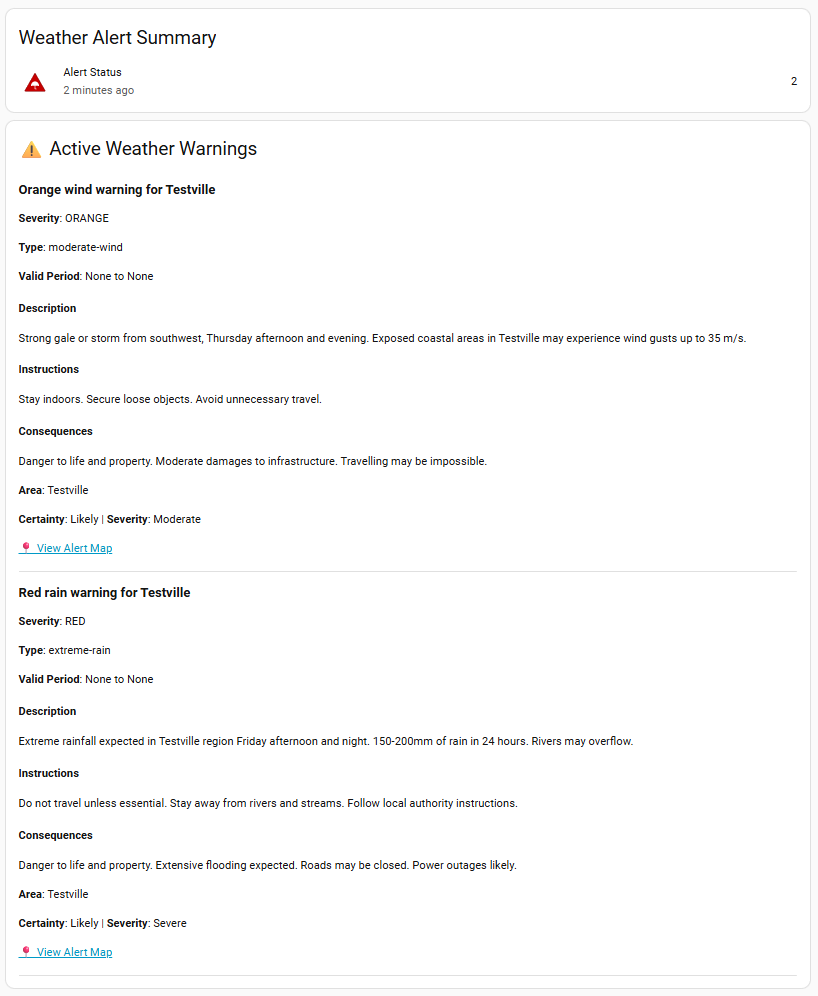

# Dashboard Card Examples for Met Alerts

This document provides ready-to-use dashboard card configurations for displaying MET Norway weather alerts in your Home Assistant UI.

## Table of Contents
- [How It Works](#how-it-works)
- [Visual Alert Icons](#visual-alert-icons)
- [Array Mode Setup](#array-mode-setup)
- [Basic Cards](#basic-cards)
- [Advanced Cards](#advanced-cards)
- [Automations](#automations)

---

## How It Works

Met Alerts integration offers two sensor modes:

### Array Mode (Recommended)
- **Single sensor** with all alerts as an attribute array
- Entity ID: `sensor.met_alerts` (or your custom name)
- State: Number of active alerts or "No Alert"
- All alert details available in the `alerts` attribute

### Legacy Mode
- **Four separate sensors** (sensor, sensor_2, sensor_3, sensor_4)
- Each shows one alert
- For backward compatibility

**This guide focuses on Array Mode** - it's simpler and more flexible!

---

## Visual Alert Icons

The sensors automatically display warning icons from Yr.no (NRK) based on the most severe alert:

The icons are displayed automatically in entity cards via the `entity_picture` property. No configuration needed!

**Available icon types:**
- Avalanches (yellow, orange, red)
- Flood (yellow, orange, red)
- Forest Fire (yellow, orange, red)
- Ice (yellow, orange, red)
- Rain (yellow, orange, red)
- Snow (yellow, orange, red)
- Wind (yellow, orange, red)

---

## Array Mode Setup

To use array mode, configure the integration with:
- **Sensor Mode**: Array (recommended)

You'll get a single sensor entity (e.g., `sensor.met_alerts`) that contains:
- **State**: Number of active alerts (or "No Alert")
- **Attribute `alerts`**: Array of all alert details

---

## Basic Cards

### 1. Minimal Status Card

Shows current alert status with automatic icon:

```yaml
type: entities
title: Weather Alerts
entities:
  - entity: sensor.met_alerts
    name: Active Alerts
    secondary_info: last-changed
```

### 2. Compact Alert List

Quick overview of all alerts:

```yaml
type: markdown
title: Active Weather Alerts
content: |
  
  
    
  **{{ alert.title }}**
  {{ alert.awareness_level_color|upper }} - {{ alert.description[:100] }}...
  Valid: {{ alert.starttime }} to {{ alert.endtime }}
  ---
    
  
  ✅ No active weather alerts
  
```

### 3. Alert Count Badge

Simple numerical display:

```yaml
type: entity
entity: sensor.met_alerts
name: Weather Alerts
icon: mdi:alert
```

### 4. Glance Card (Status Overview)

```yaml
type: glance
title: Weather Alert Status
entities:
  - entity: sensor.met_alerts
    name: Active Alerts
columns: 1
```

---

## Advanced Cards

### 5. Detailed Alert Display

Shows all alert information with full formatting:

```yaml
type: vertical-stack
cards:
  - type: entities
    title: Weather Alert Summary
    entities:
      - entity: sensor.met_alerts
        name: Alert Status
        secondary_info: last-changed
  - type: conditional
    conditions:
      - entity: sensor.met_alerts
        state_not: "No Alert"
    card:
      type: markdown
      title: ⚠️ Active Weather Warnings
      content: |
        
        
        ### {{ alert.title }}
        
        **Severity**: {{ alert.awareness_level_color|upper }}
        
        **Type**: {{ alert.event_awareness_name }}
        
        **Valid Period**: {{ alert.starttime }} to {{ alert.endtime }}
        
        #### Description
        {{ alert.description }}
        
        
        #### Instructions
        {{ alert.instruction }}
        
        
        
        #### Consequences
        {{ alert.consequences }}
        
        
        
        **Area**: {{ alert.area }}
        
        
        **Certainty**: {{ alert.certainty }} | **Severity**: {{ alert.severity }}
        
        
        [📍 View Alert Map]({{ alert.resources[0].uri }})
        
        
        ---
        
```

Example:



### 6. Severity-Based Color Card

Conditional card that only shows for higher severity alerts:

```yaml
type: conditional
conditions:
  - entity: sensor.met_alerts
    state_not: "No Alert"
card:
  type: markdown
  title: Important Weather Alerts
  content: |
    
    
      
    ## ⚠️ {{ alert.title }}
    
    **{{ alert.awareness_level_color|upper }} ALERT**
    
    {{ alert.description }}
    
    **Valid until**: {{ alert.endtime }}
    
    
    **Action Required**: {{ alert.instruction }}
    
    
    ---
      
    
```

### 7. Specific Alert Type Filter

Show only certain types of alerts (e.g., wind warnings):

```yaml
type: markdown
title: Wind Warnings
content: |
  
  
  
    
  **{{ alert.title }}**
  {{ alert.description }}
  Valid: {{ alert.starttime }} to {{ alert.endtime }}
  ---
    
  
  ✅ No active wind warnings
  
```

### 8. Custom Icon Display

Access and display the alert icon in custom cards:

```yaml
type: markdown
content: |
  
  
  
  
  <div style="text-align: center;">
    
    <h3>{{ states('sensor.met_alerts') }} Active Alert(s)</h3>
  </div>
  
  
  
    
  **{{ alert.title }}** - {{ alert.awareness_level_color }}
    
  
  ✅ No active weather alerts
  
```

### 9. Multi-Column Layout

Display alerts in a grid:

```yaml
type: grid
cards:
  - type: entity
    entity: sensor.met_alerts
    name: Total Alerts
    icon: mdi:weather-lightning
  - type: markdown
    content: |
      
      **Types:**
      
      • {{ alert.event_awareness_name }}
      
  - type: markdown
    content: |
      
      **Severity:**
      
      • {{ alert.awareness_level_color }}
      
columns: 3
```

### 10. Time-Based Alert List

Shows when each alert starts and ends:

```yaml
type: markdown
title: Alert Timeline
content: |
  
  
  | Alert | Start | End |
  |-------|-------|-----|
    
  | {{ alert.event_awareness_name }} | {{ alert.starttime }} | {{ alert.endtime }} |
    
  
  No active alerts
  
```

---

## Automations

### 1. New Alert Notification

Get notified when a new weather alert is issued:

```yaml
automation:
  - alias: "Weather Alert Notification"
    trigger:
      - platform: state
        entity_id: sensor.met_alerts
    condition:
      - condition: template
        value_template: "{{ trigger.to_state.state != 'No Alert' }}"
    action:
      - service: notify.mobile_app_your_phone
        data:
          title: "⚠️ Weather Alert"
          message: |
            {{ states('sensor.met_alerts') }} active alert(s)
            
            
            
            {{ alerts[0].title }}: {{ alerts[0].description[:100] }}...
            
          data:
            
            
            url: "{{ alerts[0].resources[0].uri }}"
            
            tag: met_alert
            importance: high
```

### 2. High Severity Alert

Only notify for orange and red alerts:

```yaml
automation:
  - alias: "Severe Weather Alert"
    trigger:
      - platform: state
        entity_id: sensor.met_alerts
    condition:
      - condition: template
        value_template: |
          
          
            {{ alerts | selectattr('awareness_level_color', 'search', 'orange|red', ignorecase=True) | list | length > 0 }}
          
            false
          
    action:
      - service: notify.mobile_app_your_phone
        data:
          title: "🚨 SEVERE WEATHER ALERT"
          message: |
            
            
            {{ severe[0].awareness_level_color|upper }}: {{ severe[0].title }}
            
            {{ severe[0].description }}
          data:
            importance: max
            priority: high
```

### 3. Alert Cleared Notification

Get notified when alerts are cleared:

```yaml
automation:
  - alias: "Weather Alert Cleared"
    trigger:
      - platform: state
        entity_id: sensor.met_alerts
        to: "No Alert"
    action:
      - service: notify.mobile_app_your_phone
        data:
          title: "✅ Weather Alert Cleared"
          message: "All weather alerts have been cleared for your area."
          data:
            tag: met_alert
```

---

## 📋 Ready-to-Use Template Library

This section provides **copy-paste ready templates** for common use cases. Just copy the entire code block and paste into your dashboard!

### Template 1: Compact Single-Line Status

**Perfect for:** Glance cards, header status
**What it shows:** Just the count and highest severity

```jinja2

⚠️ {{ alerts | count }} active alert(s) - Highest: {{ alerts | sort(attribute='awareness_level_numeric', reverse=True) | map(attribute='awareness_level_color') | first | upper }}✅ No active weather alerts
```

**Output example:** `⚠️ 2 active alert(s) - Highest: ORANGE`

---

### Template 2: Simple Bulleted List

**Perfect for:** Quick overview, mobile dashboards
**What it shows:** Title and timeframe for each alert

```jinja2


**Active Weather Alerts ({{ alerts | count }})**

• **{{ alert.title }}**
  Valid: {{ alert.starttime }} to {{ alert.endtime }}


No active weather alerts

```

---

### Template 3: Color-Coded Severity Badges

**Perfect for:** Visual dashboards, at-a-glance severity
**What it shows:** Alerts with colored severity indicators

```jinja2



<div style="padding: 8px; margin: 4px 0; border-left: 4px solid {{ alert.awareness_level_color }}; background: rgba(198,0,0255,157,0255,230,0, 0.1);">
<b>{{ alert.title }}</b><br>
<small>{{ alert.event_awareness_name | upper }} • {{ alert.awareness_level_color | upper }}</small>
</div>


✅ No active weather alerts

```

---

### Template 4: Detailed Alert Cards

**Perfect for:** Full information display, desktop dashboards
**What it shows:** Complete alert details with instructions

```jinja2



---
### 🚨 {{ alert.title }}

**Type:** {{ alert.event_awareness_name | title }}
**Severity:** {{ alert.awareness_level_color | upper }} ({{ alert.certainty }})
**Active:** {{ alert.starttime }} → {{ alert.endtime }}
**Area:** {{ alert.area }}

**Description:**
{{ alert.description }}


**What to do:**
{{ alert.instruction }}



**Potential consequences:**
{{ alert.consequences }}




No active weather alerts

```


---

### Template 5: Red Alerts Only (Critical)

**Perfect for:** Emergency displays, high-priority notifications
**What it shows:** Only red/extreme alerts

```jinja2



🚨 **EXTREME WEATHER WARNING** 🚨

### {{ alert.title }}
{{ alert.description }}

⚠️ **ACTION REQUIRED:** {{ alert.instruction }}

Valid: {{ alert.starttime }} to {{ alert.endtime }}


No extreme weather warnings

```

---

### Template 6: Timeline View with Countdown

**Perfect for:** Showing when alerts become active/expire
**What it shows:** Time until alert starts/ends

```jinja2


**Weather Alert Timeline**





• **{{ alert.title }}**
  
  ⏰ Starts in {{ ((start - now) / 3600) | round(1) }} hours
  
  🔴 ACTIVE - Ends in {{ ((end - now) / 3600) | round(1) }} hours
  
  ✅ Expired
  


No active weather alerts

```

---

### Template 7: Grouped by Severity

**Perfect for:** Organized display, priority sorting
**What it shows:** Alerts grouped into Red/Orange/Yellow sections

```jinja2






### 🔴 EXTREME WEATHER ({{ red | count }})

• **{{ alert.title }}** - {{ alert.event_awareness_name }}




### 🟠 SEVERE WEATHER ({{ orange | count }})

• **{{ alert.title }}** - {{ alert.event_awareness_name }}




### 🟡 MODERATE WEATHER ({{ yellow | count }})

• **{{ alert.title }}** - {{ alert.event_awareness_name }}




✅ No active weather alerts

```

---

### Template 8: Mobile-Optimized Summary

**Perfect for:** Phone/tablet dashboards, quick glance
**What it shows:** Compact icons and minimal text

```jinja2




{{ icon }} **{{ alert.event_awareness_name | title }}** in {{ alert.area }}
<small>Until {{ alert.endtime.split('T')[0] }}</small>


✅ All Clear

```

---

### Template 9: Map Link Generator

**Perfect for:** Quick access to detailed alert maps
**What it shows:** Clickable links to Met.no maps

```jinja2


**View Detailed Alert Maps:**

• [{{ alert.title }}]({{ alert.resources[0].uri if alert.resources else 'https://www.met.no' }})


No active weather alerts

```

---

### Template 10: Conditional Display (Show Only When Alerts Active)

**Perfect for:** Clean dashboards that only show alerts when needed
**What it shows:** Entire card hidden when no alerts

```jinja2


# ⚠️ Active Weather Alerts


**{{ alert.title }}**
{{ alert.description }}

Valid until: {{ alert.endtime }}
---


```

**Note:** Use with a conditional card to completely hide when `alerts | count == 0`

---

## Tips & Tricks

### Working with Alert Arrays

The `alerts` attribute is an array. Here's how to work with it:

```jinja2
{# Get all alerts #}


{# Count alerts #}
{{ alerts | length }}

{# Get first alert #}
{{ alerts[0].title }}

{# Filter by severity #}


{# Filter by type #}


{# Sort by severity (highest first) #}

```

### Available Alert Attributes

Each alert in the array has these attributes:
- `title` - Alert title
- `starttime` - When the alert begins
- `endtime` - When the alert ends
- `description` - Full alert description
- `awareness_level` - Full level string (e.g., "2; yellow; moderate")
- `awareness_level_numeric` - Numeric level (1-4)
- `awareness_level_color` - Color code (yellow, orange, red)
- `certainty` - Certainty level
- `severity` - Severity level
- `instruction` - What to do
- `contact` - Contact information
- `resources` - Array of related resources/maps
- `area` - Affected area
- `event_awareness_name` - Type of alert (wind, rain, etc.)
- `consequences` - Potential consequences
- `map_url` - Direct PNG image URL for inline map display (e.g., `https://slaps.met.no/cap-images/*.png`)

### Icon URLs

The `entity_picture` attribute contains a base64-encoded SVG data URL that works offline:

```yaml


```

---

## Benefits

✅ **Single sensor** - All alerts in one place with array mode  
✅ **Automatic icons** - Warning level icons display automatically  
✅ **Flexible filtering** - Use Jinja2 templates to show exactly what you need  
✅ **Offline operation** - Icons are embedded, no external dependencies  
✅ **Real-time updates** - Fetches alerts every 30 minutes  
✅ **Rich data** - Complete alert information including instructions and consequences

---

## Need Help?

- Check the [README](README.md) for configuration options
- See [FRONTEND_EXAMPLES.md](FRONTEND_EXAMPLES.md) for more display ideas
- Report issues on GitHub

---

## 🗺️ Displaying Alert Maps

Met.no provides pre-generated PNG map images for most alerts. The `map_url` attribute contains direct links to these images (e.g., `https://slaps.met.no/cap-images/[uuid].png`).

**No need for separate image template sensors!** Display maps inline using markdown cards.

**Modern Approach:** Use the new Sections view for responsive, flexible layouts without card_mod dependencies.

### Simple: Map Only
```yaml
type: markdown
content: >
  
  
  
  
```

**Or in Sections View:**

```yaml
type: sections
max_columns: 1
title: Alert Map
sections:
  - type: grid
    cards:
      - type: markdown
        content: >
          
          
          
          
        grid_options:
          columns: full
          rows: auto
    column_span: 1
```

### With Alert Details (Sections View - Modern ✓)
```yaml
type: sections
max_columns: 4
title: Weather Alerts
sections:
  - type: grid
    cards:
      - type: entities
        entities:
          - sensor.met_alerts
        grid_options:
          columns: full
          rows: auto
      - type: markdown
        content: >-
          
          
          
          
          ### {{ alert.title }}
          
          {{ alert.description }}
          
          
          
          
          
          ---
          
        grid_options:
          columns: 24
          rows: auto
    column_span: 4
```

### Full Alert Details with Map (Sections View - Recommended ✓)
```yaml
type: sections
max_columns: 4
title: Weather Alerts
sections:
  - type: grid
    cards:
      - type: entities
        entities:
          - sensor.met_alerts
        grid_options:
          columns: full
          rows: auto
      - type: markdown
        content: >-
          
          
          
          
          ### {{ alert.title }}
          
          **Severity**: {{ alert.awareness_level_color|upper }}
          
          **Type**: {{ alert.event_awareness_name }}
          
          **Valid Period**: {{ alert.starttime }} to {{ alert.endtime }}
          
          #### Description
          {{ alert.description }}
          
          
          #### Instructions
          {{ alert.instruction }}
          
          
          
          #### Consequences
          {{ alert.consequences }}
          
          
          
          **Area**: {{ alert.area }}
          
          
          **Certainty**: {{ alert.certainty }} | **Severity**: {{ alert.severity }}
          
          ---
          
          
          
          
          
          
        grid_options:
          columns: 24
          rows: auto
    column_span: 4
```

### Multiple Alerts with Individual Maps (Sections View)
```yaml
type: sections
max_columns: 2
title: Active Weather Alerts
sections:
  - type: grid
    cards:
      - type: markdown
        content: >-
          
          
          
          
          ### {{ loop.index }}. {{ alert.event_awareness_name }}
          
          **{{ alert.title }}**
          
          {{ alert.description }}
          
          
          **What to do:** {{ alert.instruction }}
          
          
          **Valid:** {{ alert.starttime }} to {{ alert.endtime }}  
          **Severity:** {{ alert.severity }} | **Certainty:** {{ alert.certainty }}
          
          
          
          
          
          ---
          
        grid_options:
          columns: full
          rows: auto
    column_span: 2
```

### All Alerts with Text and Maps
```yaml
type: markdown
content: |
  
  
  ## {{ alert.event_awareness_name }}
  
  **{{ alert.title }}**
  
  {{ alert.description }}
  
  
  **What to do:** {{ alert.instruction }}
  
   Side-by-Side (Sections View - Two Column)
```yaml
type: sections
max_columns: 2
title: Weather Alert
sections:
  - type: grid
    cards:
      - type: markdown
        content: |
          
          
          ## {{ alert.event_awareness_name }}
          
          {{ alert.description }}
          
          **Severity:** {{ alert.severity }} ({{ alert.awareness_level_color|upper }})  
          **Valid:** {{ alert.starttime }} to {{ alert.endtime }}
        grid_options:
          columns: 12
          rows: auto
      - type: markdown
        content: >
          
          
          
          
        grid_options:
          columns: 12
          rows: auto
    column_span: 2
columns: 2
cards:
  - type: markdown
    content: |
      ## {{ state_attr('sensor.met_alerts', 'alerts')[0].event_awareness_name }}
      
      {{ state_attr('sensor.met_alerts', 'alerts')[0].description }}
      
      **Severity:** {{ state_attr('sensor.met_alerts', 'alerts')[0].severity }}
  - type: markdown
    content: >
      
      
      
      
```

### Option 4: Grid Layout - Icon + Text + Map

Side-by-side layout for larger screens:

```yaml
type: conditional
conditions:
  - entity: sensor.met_alerts
    state_not: "No Alert"
card:
  type: grid
  columns: 2
  cards:
    - type: markdown
      content: |
        
        
        
        ### {{ alert.title }}
        
        **{{ alert.awareness_level_color | upper }}**
        
        {{ alert.description }}
        
        
        **Action:** {{ alert.instruction }}
        
        
        Valid: {{ alert.starttime }} to {{ alert.endtime }}
        
    
    - type: picture
      image: |
        
        {{ alerts[0].map_url }}/local/placeholder.png
```

### Option 5: All Alerts with Individual Maps

Shows multiple alerts, each with its own map:

```yaml
type: vertical-stack
cards:
  
  
  - type: markdown
    content: |
      ### {{ loop.index }}. {{ alert.title }}
      **{{ alert.awareness_level_color | upper }}** | {{ alert.event_awareness_name }}
      
      {{ alert.description }}
      
      Valid: {{ alert.starttime }} to {{ alert.endtime }}
  
  - type: picture
    image: "{{ alert.map_url if alert.map_url else '/local/placeholder.png' }}"
    tap_action:
      action: url
      url_path: "{{ alert.resources[0].uri if alert.resources else 'https://www.met.no' }}"
  
```

**Note:** This uses advanced templating - may need to be split into separate cards manually.

### Accessing Map Images in Templates

```jinja2
{# Get first alert's map image URL #}


  


{# Check if map exists #}

  Map available!


{# Example map URL format #}
https://slaps.met.no/cap-images/75726e44-9d68-4785-a3df-bd0714809351.png
```

### Key Differences from Legacy Mode

| Legacy Mode | Array Mode |
|-------------|------------|
| `map_url` attribute on sensor | `map_url` in alerts array: `alerts[0].map_url` |
| Separate sensors for each alert | All alerts in one sensor |
| One image per sensor | One image per alert in array |

### No More Image Template Sensors Needed! 🎉

Unlike before, you can now access the map URL directly from the alert attributes without creating image template sensors. The `map_url` field contains the direct PNG URL from slaps.met.no.

**Benefits:**
- ✅ Direct PNG image URLs (e.g., `https://slaps.met.no/cap-images/*.png`)
- ✅ No need for image template sensors
- ✅ Pre-generated maps showing affected geographic areas
- ✅ Works offline once cached by browser
- ✅ Can be displayed inline in picture cards
- ✅ Tap action can still link to interactive Met.no page

---

**Note**: Replace `sensor.met_alerts` with your actual entity ID if you customized the name during setup.
