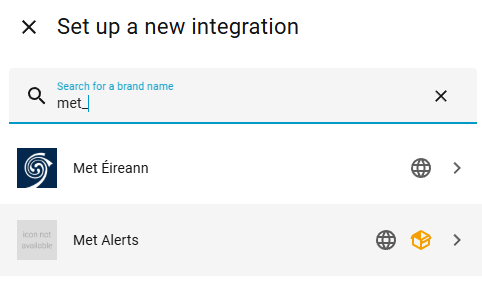
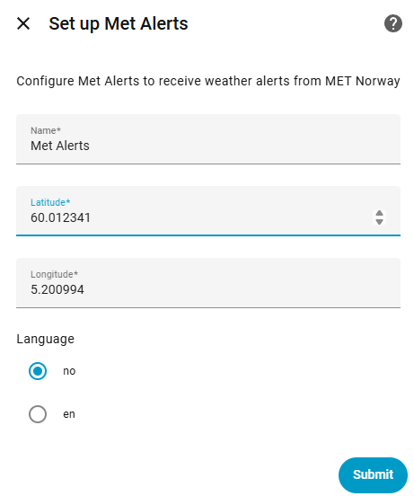
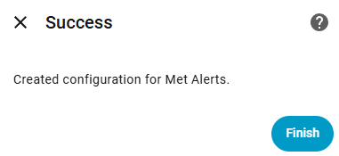
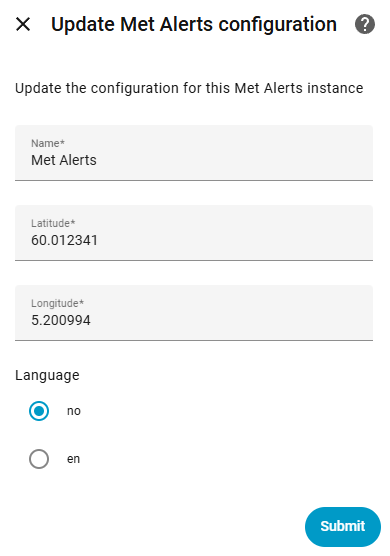

# MET Alerts Integration for Home Assistant

Welcome to the MET Alerts integration for Home Assistant! This custom component provides real-time weather alerts from MET Norway directly into your Home Assistant setup.

## Features

- 🎨 **UI Configuration** - Easy setup through Home Assistant UI (no YAML required!)
- 🔄 **Real-time Updates** - Fetches alerts every 30 minutes
- 🌍 **Multiple Languages** - Support for Norwegian and English
- 📍 **Location-based** - Configure alerts for any coordinates
- 🚨 **Multiple Alerts** - Track up to 4 simultaneous alerts
- 🗺️ **Map URLs** - Direct links to alert maps

## Screenshots

### Basic/small


### Extensive/large


## Installation

### HACS (Recommended)

1. Open HACS in Home Assistant
2. Click the three dots in the top right corner
3. Select "Custom repositories"
4. Add this repository URL: `https://github.com/kurtern84/met_alerts`
5. Select category: **Integration**
6. Click "Add"
7. Find "Met Alerts" in HACS and click "Download"
8. Restart Home Assistant

### Manual Installation

1. Download the latest release
2. Copy the `met_alerts` directory to your `custom_components` directory:
   ```
   /config/custom_components/met_alerts/
   ```
3. Restart Home Assistant

## Configuration

### UI Configuration (Recommended - v3.0+)

#### Step 1: Add the Integration

1. Go to **Settings** → **Devices & Services**
2. Click the **+ Add Integration** button in the bottom right
3. Search for "Met Alerts"
4. Click on the **Met Alerts** integration when it appears



*Screenshot: Adding Met Alerts through the integrations page*

#### Step 2: Configure Your Location

Enter your configuration details:

- **Name**: A friendly name for this alert monitor (e.g., "Home Alerts" or "Cottage Alerts")
- **Latitude**: The latitude for your location (defaults to your Home Assistant location)
- **Longitude**: The longitude for your location (defaults to your Home Assistant location)
- **Language**: Choose between:
  - `no` - Norwegian (default)
  - `en` - English



*Screenshot: Configuration form for Met Alerts*

**💡 Tip**: You can set up multiple instances for different locations (e.g., one for home, one for your cottage).

#### Step 3: Complete Setup

Click **Submit** to complete the setup. The integration will:
- Validate your coordinates with the MET Norway API
- Create 4 sensors for tracking up to 4 simultaneous alerts
- Start monitoring for weather alerts every 30 minutes




*Screenshot: Successfully added Met Alerts integration*

#### Reconfiguring Settings

To update your configuration later:

1. Go to **Settings** → **Devices & Services**
2. Find the **Met Alerts** integration
3. Click the ⚙️ **Configure** button
4. Update your settings and click **Submit**




*Screenshot: Accessing configuration options*

The integration will automatically reload with your new settings.

### YAML Configuration (Legacy - Deprecated)

> ⚠️ **Note**: YAML configuration is deprecated as of v3.0. Please migrate to UI configuration. Existing YAML configurations will continue to work but you'll see a deprecation warning in your logs.

<details>
<summary>Click to see legacy YAML configuration</summary>

```yaml
sensor:
  - platform: met_alerts
    name: MET Alerts
    latitude: YOUR_LATITUDE
    longitude: YOUR_LONGITUDE
    lang: no  # or "en" for English
```

After adding this, restart Home Assistant.

</details>

## Entities Created

The integration creates 4 sensor entities for each configured location:

| Entity ID | Description | Priority |
|-----------|-------------|----------|
| `sensor.met_alerts` | Highest priority alert | 1st (Most severe) |
| `sensor.met_alerts_2` | Second highest priority | 2nd |
| `sensor.met_alerts_3` | Third highest priority | 3rd |
| `sensor.met_alerts_4` | Fourth highest priority | 4th (Least severe) |

**Note**: Alerts are automatically sorted by awareness level (severity), with the most severe appearing in `sensor.met_alerts`.

### Sensor States

The sensor state shows the event type, or "No Alert" if no alerts are active. Common event types:
- `stormSurge` - Storm surge / high water levels
- `wind` - Strong wind
- `snow` - Heavy snow
- `ice` - Ice conditions
- `forestFire` - Forest fire danger
- `avalanches` - Avalanche danger
- `rain` - Heavy rainfall
- `flooding` - Flood warnings
- `polarLow` - Polar low pressure system
- `rain-flood` - Rain-induced flooding

### Sensor Attributes

Each sensor provides detailed information through attributes:
### Sensor Attributes

Each sensor provides detailed information through attributes:

| Attribute | Description | Example |
|-----------|-------------|---------|
| `title` | Alert title (timestamps removed) | "Høy vannstand, gult nivå, Kyst- og fjordstrøk av Rogaland" |
| `starttime` | When the alert becomes active | "2025-11-28T13:00:00+00:00" |
| `endtime` | When the alert expires | "2025-11-28T17:00:00+00:00" |
| `description` | Detailed description of the alert | Full text description in selected language |
| `awareness_level` | Full awareness level string | "2; yellow; Moderate" |
| `awareness_level_numeric` | Severity level (1-4) | "2" |
| `awareness_level_color` | Visual severity indicator | "yellow" |
| `certainty` | How certain the forecast is | "likely", "possible", "observed" |
| `severity` | Impact severity | "minor", "moderate", "severe", "extreme" |
| `instruction` | Safety instructions | What actions to take |
| `area` | Geographic area affected | Region or municipality names |
| `event_awareness_name` | Human-readable event name | "Moderate storm surge" |
| `consequences` | Potential impacts | Expected damage or disruption |
| `map_url` | URL to visual alert map (PNG) | Direct link to MET Norway map image |

#### Awareness Levels Explained

The `awareness_level_numeric` indicates severity:

| Level | Color | Meaning | Description |
|-------|-------|---------|-------------|
| 1 | 🟢 Green | Minor | Be aware. Keep yourself updated. |
| 2 | 🟡 Yellow | Moderate | Be prepared. Weather may be dangerous. |
| 3 | 🟠 Orange | Severe | Be ready to act. Dangerous weather expected. |
| 4 | 🔴 Red | Extreme | Take action immediately. Very dangerous conditions. |

## Use Cases & Examples

### Multiple Locations

You can add the integration multiple times for different locations:

1. **Home location** - Monitor alerts for your primary residence
2. **Cottage/Cabin** - Track weather at your vacation property
3. **Work location** - Stay informed about conditions affecting your commute
4. **Elderly relatives** - Monitor weather at their location for safety checks

Each instance creates its own set of 4 sensors with unique names.

### Automation Ideas

**Example 1: Send notification for severe weather**

```yaml
automation:
  - alias: "Severe Weather Alert"
    trigger:
      - platform: state
        entity_id: sensor.met_alerts
    condition:
      - condition: template
        value_template: "{{ state_attr('sensor.met_alerts', 'awareness_level_numeric') | int >= 3 }}"
    action:
      - service: notify.mobile_app
        data:
          title: "⚠️ Severe Weather Alert"
          message: >
            {{ states('sensor.met_alerts') }}: 
            {{ state_attr('sensor.met_alerts', 'title') }}
            
            {{ state_attr('sensor.met_alerts', 'instruction') }}
```

**Example 2: Flash lights when extreme weather is detected**

```yaml
automation:
  - alias: "Extreme Weather Light Warning"
    trigger:
      - platform: state
        entity_id: sensor.met_alerts
    condition:
      - condition: template
        value_template: "{{ state_attr('sensor.met_alerts', 'awareness_level_color') == 'red' }}"
    action:
      - service: light.turn_on
        target:
          entity_id: light.living_room
        data:
          flash: long
          rgb_color: [255, 0, 0]
```

**Example 3: Announce alert on smart speaker**

```yaml
automation:
  - alias: "Announce Weather Alert"
    trigger:
      - platform: state
        entity_id: sensor.met_alerts
        to: 
        from: "No Alert"
    action:
      - service: tts.google_translate_say
        target:
          entity_id: media_player.kitchen_speaker
        data:
          message: >
            Nytt værvarsle: {{ state_attr('sensor.met_alerts', 'title') }}
```

## Lovelace Dashboard Configuration
To display the MET Alerts data in your Lovelace dashboard, you can use the following configuration:

### 1. Entities Card for Basic Information
 - Add an entities card to your Lovelace dashboard: 
```yaml
type: entities
title: MET Alerts
show_header_toggle: false
entities:
  - entity: sensor.met_alerts
    name: Event
  - type: attribute
    entity: sensor.met_alerts
    attribute: title
    name: Title
  - type: attribute
    entity: sensor.met_alerts
    attribute: starttime
    name: Start time
  - type: attribute
    entity: sensor.met_alerts
    attribute: endtime
    name: End time
  - type: attribute
    entity: sensor.met_alerts
    attribute: description
    name: Description
  - type: attribute
    entity: sensor.met_alerts
    attribute: awareness_level
    name: Awareness Level
  - type: attribute
    entity: sensor.met_alerts
    attribute: awareness_level_numeric
    name: Awareness Level Numeric
  - type: attribute
    entity: sensor.met_alerts
    attribute: awareness_level_color
    name: Awareness Level Color
  - type: attribute
    entity: sensor.met_alerts
    attribute: certainty
    name: Certainty
  - type: attribute
    entity: sensor.met_alerts
    attribute: severity
    name: Severity
  - type: attribute
    entity: sensor.met_alerts
    attribute: instruction
    name: Instruction
  - type: attribute
    entity: sensor.met_alerts
    attribute: contact
    name: Contact
  - type: attribute
    entity: sensor.met_alerts
    attribute: area
    name: Area
  - type: attribute
    entity: sensor.met_alerts
    attribute: event_awareness_name
    name: Event Awareness Name
  - type: attribute
    entity: sensor.met_alerts
    attribute: consequences
    name: Consequences
  - type: attribute
    entity: sensor.met_alerts
    attribute: map_url
    name: Map URL
```

### 2. Example of displaying a the extensive/large card and the map for it, but only if there is an alert
(this card was added by [@svenove](https://github.com/svenove))
- Note that the color of the first line will be yellow/orange/red based on the severity of the alert.
- To customize:
  1. Set the weekday names in the ```set weekdays```-line. Note that the first day is Sunday!
  2. Change ```if time_diff < 24``` and set how many hours before the alert start time you want the card to be displayed/visible. Default is 24 hours.
```yaml
type: markdown
show_empty: false
content: >
        
    {% set start_timestamp = as_timestamp(strptime(start_time, "%Y-%m-%dT%H:%M:%S%z")) %}
    {% set end_timestamp = as_timestamp(strptime(end_time, "%Y-%m-%dT%H:%M:%S%z")) %}
    {% set start_day_index = start_timestamp | timestamp_custom("%w") | int %}
    {% set end_day_index = end_timestamp | timestamp_custom("%w") | int %}
    
    
    
      {% set met_alerts_time = start_day + ' kl ' + (start_timestamp | timestamp_custom("%H:%M")) + ' til ' + (end_timestamp | timestamp_custom("%H:%M")) %}
    
      {% set met_alerts_time = start_day + ' kl ' + (start_timestamp | timestamp_custom("%H:%M")) + ' til ' + end_day + ' kl ' + (end_timestamp | timestamp_custom("%H:%M")) %}
    
    
    
    ## <center><font color="{{ state_attr('sensor.met_alerts_2', 'awareness_level_color') }}"><ha-icon icon="mdi:alert"></ha-icon> Farevarsel - {{ state_attr('sensor.met_alerts_2', 'event_awareness_name') }} <ha-icon icon="mdi:alert"></ha-icon></font></center>
    ### <center>{{ met_alerts_time }}
    {{ state_attr('sensor.met_alerts_2', 'description') }}</center>
    
    <i>{{ state_attr('sensor.met_alerts_2', 'instruction') }}</i>
    
     }})
    
  
```

### 3. Markdown Card for Resources
 - Add a markdown card to display resources:

```yaml
type: markdown
title: Resources
content: >
  
  
  - [{{ resource.description }}]({{ resource.uri }})
  
  
  No resources available.
  

```
## Troubleshooting

### No Alerts Showing Up

If you have an active weather alert but it's not showing in Home Assistant:

1. **Verify your location is in the alert area**
   - Alerts are geographically specific
   - Coastal alerts (like storm surge) only apply to coastal areas
   - Check the `area` attribute to see which regions are affected

2. **Check the logs**
   - Go to **Settings** → **System** → **Logs**
   - Search for "met_alerts"
   - Look for entries showing number of alerts fetched
   
   Example log output:
   ```
   Successfully fetched Met alerts data
   Found 1 alert(s) in response
   Alert 1: event='stormSurge', awareness_level='2; yellow; Moderate'
   ```

3. **Verify coordinates**
   - Ensure your latitude/longitude are correct for your intended location
   - You can verify coordinates at [Google Maps](https://www.google.com/maps) (right-click → What's here?)

4. **Check language setting**
   - Make sure the language matches your preference
   - Some alerts may only be available in Norwegian

5. **API connectivity**
   - Ensure your Home Assistant instance can reach `api.met.no`
   - Check firewall and network settings

### Common Issues

**Issue**: "Failed to connect to MET Norway API"
- **Solution**: Check your internet connection and verify the coordinates are valid (lat: -90 to 90, lon: -180 to 180)

**Issue**: Sensors show "Unknown" or "Unavailable"  
- **Solution**: Wait for the next update cycle (30 minutes) or restart Home Assistant to force an update

**Issue**: Duplicate integrations after migration from YAML
- **Solution**: Remove the old YAML configuration from `configuration.yaml`, restart, then delete the duplicate integration from the UI

### Reconfiguring the Integration

To change your configuration:

1. Go to **Settings** → **Devices & Services**
2. Find the "Met Alerts" integration
3. Click the ⚙️ **Configure** button
4. Update your settings:
   - Change the name
   - Adjust coordinates
   - Switch language
5. Click **Submit**

The integration will automatically reload with the new configuration - no restart required!

### Removing the Integration

To completely remove Met Alerts:

1. Go to **Settings** → **Devices & Services**  
2. Find the "Met Alerts" integration
3. Click **Delete**
4. Confirm the deletion

All sensors and configuration will be removed.

## Contribution

We welcome contributions! If you find any issues or have suggestions for improvements, please open an issue or submit a pull request at https://github.com/kurtern84/met_alerts

## Frequently Asked Questions

**Q: How often does the integration check for new alerts?**  
A: Every 30 minutes. This balances timely updates with respectful API usage.

**Q: Can I monitor multiple locations?**  
A: Yes! Simply add the integration multiple times through the UI, each with different coordinates and names.

**Q: Why do I see 4 sensors?**  
A: MET Norway can issue multiple simultaneous alerts for a location. The integration creates 4 sensors sorted by severity, so you can track all active alerts.

**Q: What's the difference between Norwegian and English?**  
A: The language setting determines which language the alert text appears in (title, description, instructions). Both pull from the same alert data.

**Q: Do alerts work for locations outside Norway?**  
A: This integration uses MET Norway's API, which primarily covers Norway and surrounding areas. Alerts may not be available for locations far from Norway.

**Q: How do I know if my location has any alerts right now?**  
A: Check the MET Norway website at [https://www.met.no/vaer-og-klima/ekstremvaervarsler-og-andre-faremeldinger](https://www.met.no/vaer-og-klima/ekstremvaervarsler-og-andre-faremeldinger) to see current active alerts.

**Q: Can I adjust the update interval?**  
A: Not currently through the UI. The 30-minute interval is set to balance timeliness with API load.

**Q: What happens when an alert expires?**  
A: The sensor will automatically return to "No Alert" state at the next update after the alert's end time.

## Version History

### v3.0.0 (2025)
- ✨ **New**: UI-based configuration through Home Assistant
- ✨ **New**: Options flow for reconfiguring existing instances
- ✨ **New**: Enhanced logging for troubleshooting
- ✨ **New**: Unique IDs for proper entity registry support
- ✨ **New**: Support for multiple integration instances
- 📝 Deprecated YAML configuration (still supported with warning)
- 🐛 Various bug fixes and improvements

### v2.0.0 and earlier
- Initial YAML-based configuration
- Basic alert fetching and display
- Support for Norwegian and English languages

## Credits

Originally forked from [@kurtern84](https://github.com/kurtern84)'s version. Modernized with UI configuration support.

## License

This project is licensed under the MIT License. See the LICENSE file for details.

