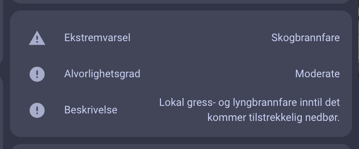

# MET Alerts Integration for Home Assistant
Welcome to the MET Alerts integration for Home Assistant! This custom component provides real-time weather alerts from MET Norway directly into your Home Assistant setup. Follow the instructions below to install and configure this integration..

### Screenshot




### Installation

1. Download the Repository
 - Download the latest version of this repository as a ZIP file.
 - Extract the contents to your Home Assistant configuration directory.
2. Copy Files
 - Copy the met_alerts directory to your custom components directory:

```
cp -r met_alerts /config/custom_components/

```
3. Install Dependencies
 - Ensure you have the required dependencies installed. If you are using Home Assistant Supervised or Home Assistant OS, dependencies are managed for you.

### Configuration
1. Update configuration.yaml
 - Add the following configuration to your configuration.yaml file:

```yaml
sensor:
  - platform: met_alerts
    name: MET Alerts
    latitude: YOUR_LATITUDE
    longitude: YOUR_LONGITUDE

```

Replace YOUR_LATITUDE and YOUR_LONGITUDE with the coordinates for the location you want to monitor.

2. Restart Home Assistant
 - Restart Home Assistant to apply the changes:

```
sudo systemctl restart home-assistant.service
```

### Lovelace Dashboard Configuration
To display the MET Alerts data in your Lovelace dashboard, you can use the following configuration:

1. Entities Card for Basic Information
 - Add an entities card to your Lovelace dashboard: 
```yaml
type: entities
title: MET Alerts
show_header_toggle: false
entities:
  - entity: sensor.met_alerts
    name: Event
  - type: attribute
    entity: sensor.met_alerts
    attribute: title
    name: Title
  - type: attribute
    entity: sensor.met_alerts
    attribute: description
    name: Description
  - type: attribute
    entity: sensor.met_alerts
    attribute: awareness_level
    name: Awareness Level
  - type: attribute
    entity: sensor.met_alerts
    attribute: certainty
    name: Certainty
  - type: attribute
    entity: sensor.met_alerts
    attribute: severity
    name: Severity
  - type: attribute
    entity: sensor.met_alerts
    attribute: instruction
    name: Instruction
  - type: attribute
    entity: sensor.met_alerts
    attribute: contact
    name: Contact
  - type: attribute
    entity: sensor.met_alerts
    attribute: area
    name: Area
  - type: attribute
    entity: sensor.met_alerts
    attribute: event_awareness_name
    name: Event Awareness Name
  - type: attribute
    entity: sensor.met_alerts
    attribute: consequences
    name: Consequences

```

2. Markdown Card for Resources
 - Add a markdown card to display resources:

```yaml
type: markdown
title: Resources
content: >
  
  
  - [{{ resource.description }}]({{ resource.uri }})
  
  
  No resources available.
  

```
### Troubleshooting
- JSON Decode Error
  If you encounter a JSON decode error, ensure the URL and coordinates in your configuration are correct.
- Custom Element Doesn't Exist
  If you see "Custom element doesn't exist: attribute-table-card," make sure you have installed any necessary custom cards or use the recommended markdown configuration above.

### Contribution
We welcome contributions! If you find any issues or have suggestions for improvements, please open an issue or submit a pull request.

### License
This project is licensed under the MIT License. See the LICENSE file for details.

