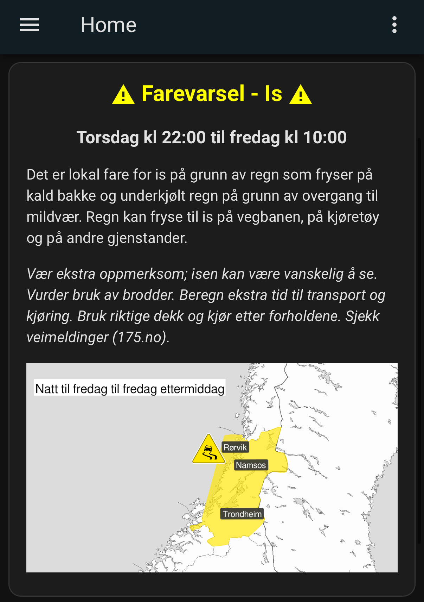

# MET Alerts Integration for Home Assistant
Welcome to the MET Alerts integration for Home Assistant! This custom component provides real-time weather alerts from MET Norway directly into your Home Assistant setup. Follow the instructions below to install and configure this integration..

## Screenshots
### Basic/small


### Extensive/large


## Installation
### HACS
1. In HACS, three dots, custom repositories, paste the URL for this repo (https://github.com/kurtern84/met_alerts) and select type=integration.
2. Download the integration from HACS.
3. Restart Home Assistant and follow the steps listed under "configuration" further down on this page.

### Manual
1. Download the Repository
 - Download the latest version of this repository as a ZIP file.
 - Extract the contents to your Home Assistant configuration directory.
2. Copy Files
 - Copy the met_alerts directory to your custom components directory:

```
cp -r met_alerts /config/custom_components/
```
3. Install Dependencies
 - Ensure you have the required dependencies installed. If you are using Home Assistant Supervised or Home Assistant OS, dependencies are managed for you.

## Configuration
1. Update configuration.yaml
 - Add the following configuration to your configuration.yaml file:

```yaml
sensor:
  - platform: met_alerts
    name: MET Alerts
    latitude: YOUR_LATITUDE
    longitude: YOUR_LONGITUDE

```

Replace YOUR_LATITUDE and YOUR_LONGITUDE with the coordinates for the location you want to monitor.

2. Restart Home Assistant to apply the changes.

## Lovelace Dashboard Configuration
To display the MET Alerts data in your Lovelace dashboard, you can use the following configuration:

### 1. Entities Card for Basic Information
 - Add an entities card to your Lovelace dashboard: 
```yaml
type: entities
title: MET Alerts
show_header_toggle: false
entities:
  - entity: sensor.met_alerts
    name: Event
  - type: attribute
    entity: sensor.met_alerts
    attribute: title
    name: Title
  - type: attribute
    entity: sensor.met_alerts
    attribute: starttime
    name: Start time
  - type: attribute
    entity: sensor.met_alerts
    attribute: endtime
    name: End time
  - type: attribute
    entity: sensor.met_alerts
    attribute: description
    name: Description
  - type: attribute
    entity: sensor.met_alerts
    attribute: awareness_level
    name: Awareness Level
  - type: attribute
    entity: sensor.met_alerts
    attribute: awareness_level_numeric
    name: Awareness Level Numeric
  - type: attribute
    entity: sensor.met_alerts
    attribute: awareness_level_color
    name: Awareness Level Color
  - type: attribute
    entity: sensor.met_alerts
    attribute: certainty
    name: Certainty
  - type: attribute
    entity: sensor.met_alerts
    attribute: severity
    name: Severity
  - type: attribute
    entity: sensor.met_alerts
    attribute: instruction
    name: Instruction
  - type: attribute
    entity: sensor.met_alerts
    attribute: contact
    name: Contact
  - type: attribute
    entity: sensor.met_alerts
    attribute: area
    name: Area
  - type: attribute
    entity: sensor.met_alerts
    attribute: event_awareness_name
    name: Event Awareness Name
  - type: attribute
    entity: sensor.met_alerts
    attribute: consequences
    name: Consequences
  - type: attribute
    entity: sensor.met_alerts
    attribute: map_url
    name: Map URL
```

### 2. Example of displaying a the extensive/large card and the map for it, but only if there is an alert
(this card was added by [@svenove](https://github.com/svenove))
- Note that the color of the first line will be yellow/orange/red based on the severity of the alert.
- To customize:
  1. Set the weekday names in the ```set weekdays```-line. Note that the first day is Sunday!
  2. Change ```if time_diff < 24``` and set how many hours before the alert start time you want the card to be displayed/visible. Default is 24 hours.
```yaml
type: markdown
show_empty: false
content: >
        
    {% set start_timestamp = as_timestamp(strptime(start_time, "%Y-%m-%dT%H:%M:%S%z")) %}
    {% set end_timestamp = as_timestamp(strptime(end_time, "%Y-%m-%dT%H:%M:%S%z")) %}
    {% set start_day_index = start_timestamp | timestamp_custom("%w") | int %}
    {% set end_day_index = end_timestamp | timestamp_custom("%w") | int %}
    
    
    
      {% set met_alerts_time = start_day + ' kl ' + (start_timestamp | timestamp_custom("%H:%M")) + ' til ' + (end_timestamp | timestamp_custom("%H:%M")) %}
    
      {% set met_alerts_time = start_day + ' kl ' + (start_timestamp | timestamp_custom("%H:%M")) + ' til ' + end_day + ' kl ' + (end_timestamp | timestamp_custom("%H:%M")) %}
    
    
    
    ## <center><font color="{{ state_attr('sensor.met_alerts_2', 'awareness_level_color') }}"><ha-icon icon="mdi:alert"></ha-icon> Farevarsel - {{ state_attr('sensor.met_alerts_2', 'event_awareness_name') }} <ha-icon icon="mdi:alert"></ha-icon></font></center>
    ### <center>{{ met_alerts_time }}
    {{ state_attr('sensor.met_alerts_2', 'description') }}</center>
    
    <i>{{ state_attr('sensor.met_alerts_2', 'instruction') }}</i>
    
     }})
    
  
```

### 3. Markdown Card for Resources
 - Add a markdown card to display resources:

```yaml
type: markdown
title: Resources
content: >
  
  
  - [{{ resource.description }}]({{ resource.uri }})
  
  
  No resources available.
  

```
## Troubleshooting
### JSON Decode Error
 - If you encounter a JSON decode error, ensure the URL and coordinates in your configuration are correct.

### Custom Element Doesn't Exist
 - If you see "Custom element doesn't exist: attribute-table-card," make sure you have installed any necessary custom cards or use the recommended markdown configuration above.

## Contribution
We welcome contributions! If you find any issues or have suggestions for improvements, please open an issue or submit a pull request.

## License
This project is licensed under the MIT License. See the LICENSE file for details.

